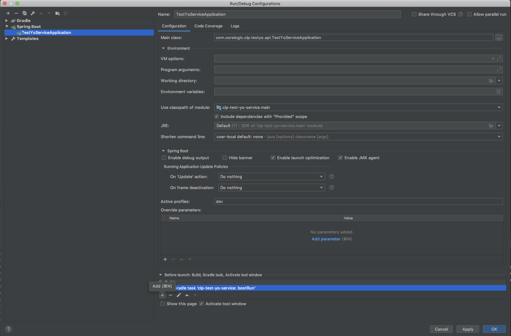
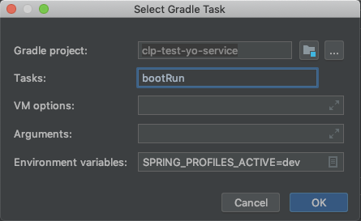

# CLP <%=applicationNameWithSpaces%> Service 

>**NOTE** Contribute by creating a pull request following this [guideline](https://github.com/corelogic/clp-conventions/wiki/Submitting-Pull-Requests)

The <%=applicationNameWithSpaces%> Service <%=serviceDescription%>.

## Integrating with the CLP <%=applicationNameWithSpaces%> Service
If this is the first time you are working with CoreLogic Services, you must obtain service credentials for your application by requesting them from the CoreLogic Operations Team on their [Slack channel](https://clgx-idc.slack.com/messages/ask-dev-n-ops/). You will need a CF Apigee Client and User registered and will need to obtain the following properties:

  - `clientId`: Name of your Apigee client
  - `secret`: Password for your Apigee client
  - **Important**: Make sure that you request the `<%=fullServiceName%>.application` scope as well as the `client_credentials` grant type in order to access the <%=applicationNameWithSpaces%> Service API. 
  - If you already have credentials, please ask that the above scope be added to your client and user, and confirm/add `client_credentials` grant type. 

### Spring Boot Applications

If you are integrating using a **Spring Boot** application, you can pull in the [Starter](https://github.com/corelogic/clp-spring-boot-starters/tree/master/<%=fullServiceName%>-starter) for easy consumption. You can pull from the CoreLogic Nexus Repository in your `build.gradle` as follows:

```groovy
buildscript {
    repositories {
        maven { url "https://repo.corelogic.net/nexus/content/groups/m2/" }
    }
}
  
[...]
  
dependencies {
	compile('com.corelogic.clp.starters:<%=fullServiceName%>-starter:{{VERSION}}')
}
```

## Developing on the <%=applicationNameWithSpaces%> Service

### Workstation Setup

#### Check Out Code from Git Repo

```
$ mkdir ~/workspace
$ cd ~/workspace
$ git clone https://github.com/corelogic/<%=fullServiceName%>.git
```

#### Update Project References

- Modify the `~/.bash_profile` to ensure our `.git-authors` file is referenced by `git-duet` and that we rotate on each commit:

   ```
   export GIT_DUET_AUTHORS_FILE=~/workspace/<%=fullServiceName%>/.git-authors
   export GIT_DUET_ROTATE_AUTHOR=1
   ```
#### Implementing the ChargeBack service.

The ChargeBack service has been added to this application as a way to track the traffic using each endpoint. The idea is to add it to every new endpoint that gets created. Use the 'helloWorld/' endpoint as an example.  The ChargeBack service/repository is not meant to be modified.

#### PostgreSQL and Redis

You can use the dummyObject suite in order to implement either Postgres or Redis. Make sure to edit the *.sql file to add any new tables/properties that you want to persist. Both the PostgreSQL and Redis databases are configured in the docker folder. When running `./gradlew clean build`, the PostgreSQL and Redis databases start automatically. Currently, the databases start on their default port of `5342` and `6379` respectively.
**If there is another instance of PostgreSQL or Redis running locally, it needs to be stopped manually with docker (remove if container name matches).** You can start and stop PostgreSQL and Redis databases with the gradle `composeUp` and `composeDown` tasks. 

#### Swagger

You can use <%=applicationNameWithSpaces%> Service 

You can try out the `/helloWorld` endpoint using Swagger. 
1. Go to `localhost:8084`
1. Click the `Authorize` button to enter credentials
1. Choose an endpoint button (ex. GET)
1. Click the `Try it out` button
1. Click `Execute`

**Note**: Swagger should use `http` locally, and `https` when deployed. The `swagger.protocol=https` setting should be added to the manifest.

## Usage

To access the `/helloWorld` endpoint, an access token is required. To obtain an access token, do a POST request to `localhost:8084/oauth/token?grant_type=client_credentials` 
using Basic Auth with username: `fake-client` and password: `secret`.

## Access Token Validation

Example of token validation URI definition in Cloud Config:

```
security:
  oauth2:
    resource:
      jwk:
        key-set-uri: https://corelogic-np-test.apigee.net/edgemicro-auth/jwkPublicKeys
```

 CF environment          | APIGEE VALIDATE TOKEN URI                   
| -------------- | ------------------------------------------ | 
| `INT/preprod`  | https://corelogic-np-test.apigee.net/edgemicro-auth/jwkPublicKeys | 
| -------------- | ------------------------------------------------------------------------------------------ | 
| `UAT`          | https://corelogic-uat.apigee.net/edgemicro-auth/jwkPublicKeys| 
| -------------- | ------------------------------------------------------------------------------------------ |  
| `PROD`         | https://corelogic-prod.apigee.net/edgemicro-auth/jwkPublicKeys | 


## Booting Up the <%=applicationNameWithSpaces%> Service Locally
* Boot up <%=applicationNameWithSpaces%> Service Server:

   ```
   $ cd ~/workspace/<%=fullServiceName%>-service
   $ SPRING_PROFILES_ACTIVE=dev ./gradlew clean bootRun
   ```
  
  * Configuring intellij to run the application:
  To run from intellij using the green arrow in the top right, you alter your configuration to include the docker database images.
  Open your Spring Boot Configuration by opening the dropdown in the right and clicking 'Edit Configurations.'
  In the Build section of the configuration page, add a gradle task.
  
  Fill out the add gradle task form with the following information:  Gradle Project = {your project name}, tasks = bootRun, and Environment Variables = SPRING_PROFILES_ACTIVE=dev
  
    
